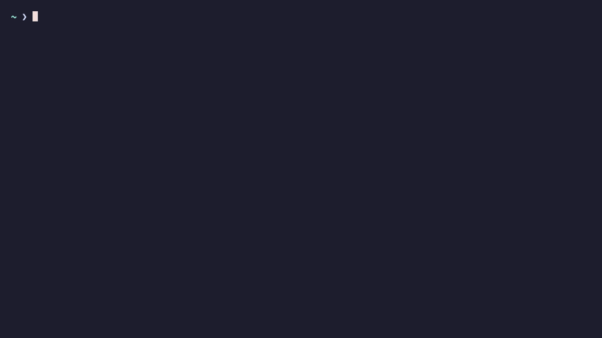
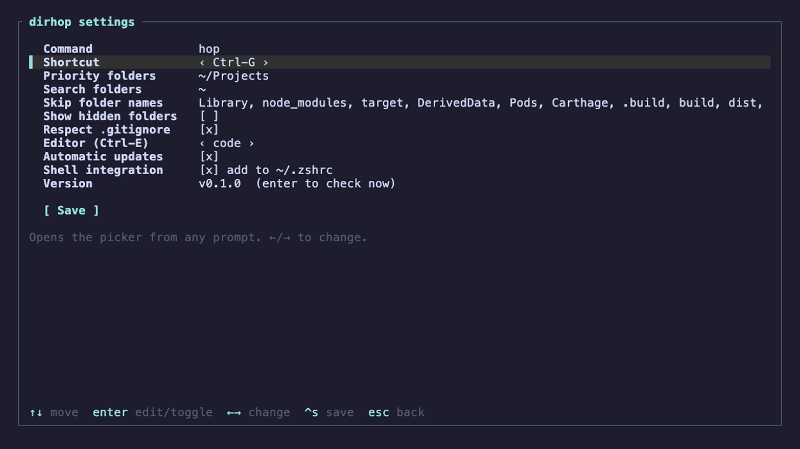

<div align="center">

# dirhop

**Jump to any folder in a few keystrokes.**

A fast fuzzy folder picker for your terminal, written in Rust.
Type a few letters, hit Enter, and you're there.

[](https://github.com/jx-grxf/dirhop/actions/workflows/ci.yml)
[](https://github.com/jx-grxf/dirhop/releases/latest)
[](LICENSE)



</div>

## Why

`cd ~/Projects/clients/acme/ios/App` gets old fast. Most folder jumpers only know folders you've
already visited. dirhop searches **every folder in your home directory**, live, while you type.
Your projects and the places you go most often stay at the top.

- **Fast.** A parallel scan of ~10,000 folders takes under 100 ms. Results stream in while you type.
- **Projects first.** Git repos and folders in `~/Projects`, `~/Developer`, `~/code` and similar rank above the rest.
- **Learns.** Folders you pick often move up. If you use [zoxide](https://github.com/ajeetdsouza/zoxide), its history counts too.
- **Preview.** Shows the git branch, the detected language (Rust, Swift, TypeScript, Go, Python and more) and what's inside.
- **Your command, your shortcut.** Call it `hop`, `p`, `j` or anything you like, and bind it to Ctrl-G, Alt-J or another key.
- **Updates itself.** New releases are installed automatically, with SHA-256 verification. You can turn this off.
- **No setup files to edit.** Everything is set up in a small settings screen.

## Install

```sh
curl -fsSL https://raw.githubusercontent.com/jx-grxf/dirhop/main/install.sh | sh
```

The script downloads the right binary for your Mac or Linux machine, checks its checksum, puts it
in `~/.local/bin` and opens the setup screen. Pick a command name and a shortcut, save, then open
a new terminal.

<details>
<summary>Other ways to install</summary>

**With Cargo**

```sh
cargo install --git https://github.com/jx-grxf/dirhop
dirhop setup
```

**Manually.** Grab a tarball from the [releases page](https://github.com/jx-grxf/dirhop/releases/latest),
put `dirhop` anywhere you like and run `dirhop setup`.

**Shell integration by hand.** `dirhop setup` adds one line to your shell config. If you'd rather do it
yourself:

```sh
# ~/.zshrc
eval "$(dirhop init zsh)"
# ~/.bashrc
eval "$(dirhop init bash)"
# ~/.config/fish/config.fish
dirhop init fish | source
```

</details>

Supports macOS (Apple Silicon and Intel) and Linux (x86_64 and arm64), with zsh, bash or fish.

## Usage

| | |
|---|---|
| `hop` | open the picker |
| `hop api` | open it with `api` already typed |
| <kbd>Ctrl</kbd>+<kbd>G</kbd> | open it from any prompt, even mid-command |

`hop` is the default. You choose the name and the shortcut during setup.

**In the picker**

| Key | Action |
|---|---|
| type | fuzzy search (`'exact`, `^prefix`, `suffix$` and `!not` work too) |
| <kbd>Enter</kbd> | cd into the folder |
| <kbd>↑</kbd> <kbd>↓</kbd> / <kbd>Ctrl</kbd>+<kbd>P</kbd> <kbd>Ctrl</kbd>+<kbd>N</kbd> | move |
| <kbd>Tab</kbd> | search inside the highlighted folder |
| <kbd>Ctrl</kbd>+<kbd>O</kbd> | open in Finder (or your file manager) |
| <kbd>Ctrl</kbd>+<kbd>E</kbd> | open in your editor (VS Code, Cursor, Zed, IntelliJ, Neovim…) |
| <kbd>Ctrl</kbd>+<kbd>S</kbd> | settings |
| <kbd>Ctrl</kbd>+<kbd>R</kbd> | rescan |
| <kbd>Ctrl</kbd>+<kbd>U</kbd> / <kbd>Ctrl</kbd>+<kbd>W</kbd> | clear query / delete word |
| <kbd>Esc</kbd> | cancel |

## Settings

Run `dirhop setup` or press <kbd>Ctrl</kbd>+<kbd>S</kbd> inside the picker.



| Setting | Default |
|---|---|
| Command | `hop` |
| Shortcut | Ctrl-G (also Alt-J, Alt-G, Ctrl-Y, Ctrl-F, Ctrl-T or off) |
| Priority folders | whichever of `~/Projects`, `~/Developer`, `~/dev`, `~/code`, `~/src`, `~/repos`… exist |
| Search folders | `~` |
| Skipped folder names | `Library`, `node_modules`, `target`, `DerivedData`, `Pods`, `build`, `dist`, `.venv`… |
| Hidden folders | off |
| Respect `.gitignore` | on |
| Editor | the first one found on your PATH |
| Automatic updates | on, checked at most once a day |

Settings live in `~/.config/dirhop/config.toml`, so you can edit that file directly too.
Your jump history is stored in `~/.local/share/dirhop/`.

## Commands

```text
dirhop [QUERY]         open the picker and print the chosen folder
dirhop setup           settings screen
dirhop init <shell>    print the shell integration (zsh, bash, fish)
dirhop query <QUERY>   print the best match without a UI (-n 10 for more)
dirhop update          update now
dirhop --version
```

Because dirhop prints the chosen path, it also works in scripts: `code "$(dirhop query api)"`.

## How it works

A program can't change your shell's working directory, so dirhop draws its UI on stderr and
prints the chosen folder on stdout. A small shell function then `cd`s there. The scan uses the
same parallel walker as ripgrep, and matching uses the fuzzy matcher from the Helix editor.
Ranking combines match quality, whether the folder is a git repo or sits in a priority folder,
how deep it is, and how often you've picked it.

Updates come from this repo's GitHub releases. dirhop downloads the archive for your platform,
checks it against the published SHA-256 and swaps the binary atomically. Set
`DIRHOP_NO_UPDATE=1` or turn the setting off to skip this. Copies installed with Homebrew or Nix,
or run straight from a Cargo `target/` folder, never update themselves.

## Uninstall

```sh
rm ~/.local/bin/dirhop
rm -rf ~/.config/dirhop ~/.local/share/dirhop
```

Then delete the `dirhop` line from your `~/.zshrc`, `~/.bashrc` or `~/.config/fish/conf.d/dirhop.fish`.

## Development

```sh
cargo run -- setup                    # settings screen
cargo run -- query weather -n 5       # ranking without the UI
cargo test && cargo clippy --all-targets
```

To cut a release, bump the version in `Cargo.toml` and push a `vX.Y.Z` tag. The release workflow
builds all four targets and publishes them along with checksums. The demo GIF and screenshots are recorded with
[vhs](https://github.com/charmbracelet/vhs): `sh assets/demo-home.sh && vhs assets/demo.tape`.

## License

[MIT](LICENSE) © Johannes Grof
